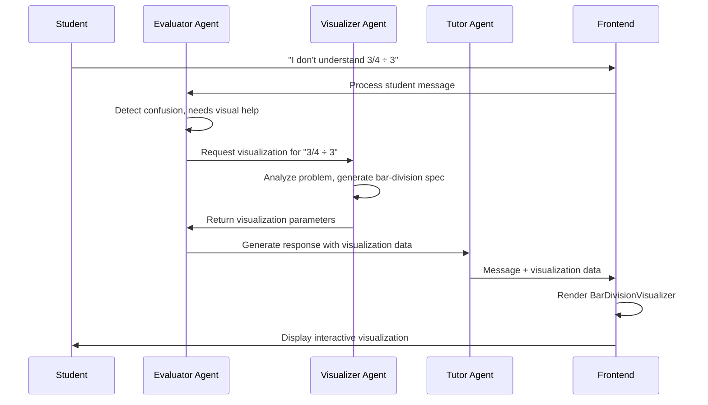

# Fraction Visualization System Architecture

## Overview

This document outlines the comprehensive architecture for implementing AI-driven interactive fraction visualizations within the chat interface. The system uses a multi-agent approach where AI agents determine visualization parameters and the frontend acts as a "dumb" renderer.

## Core Architecture Principles

### AI-Driven Intelligence
- **Fractions Visualizer Agent**: New AI agent responsible for analyzing problems and generating visualization specifications
- **Evaluator Agent Enhancement**: Determines when visualizations are needed (e.g., after 2 hints, on wrong answers, for new problems)
- **Tutor Agent Integration**: Incorporates visualization data into chat responses
- **No Frontend Logic**: All problem analysis and visualization decisions happen in AI agents

### Frontend as Renderer
- **Dumb Components**: Frontend components only render what AI provides
- **No Problem Analysis**: No parsing, detection, or decision-making in React components
- **Pure SVG + React**: Leverages existing infrastructure, no additional dependencies
- **Theme Integration**: Seamless Discord-style theming across all visualizations

---

## Agent System Design

### New Agent: Fractions Visualizer

**Purpose**: Analyze fraction division problems and generate exact visualization specifications

**Input Parameters**:
```typescript
interface VisualizerInput {
  problemText: string;           // Original math problem
  studentContext: string;        // Student's current understanding level
  triggerReason: string;         // Why visualization is needed
  previousAttempts?: string[];   // Student's previous answers
  currentDifficulty: 'easy' | 'medium' | 'hard';
}
```

**Output Specification**:
```json
{
  "visualizationType": "bar-division",
  "problemData": {
    "numerator": 3,
    "denominator": 4,
    "divisor": 3,
    "context": "flour-loaves",
    "contextLabels": {
      "original": "3/4 cup of flour",
      "division": "3 equal loaves",
      "result": "flour per loaf"
    }
  },
  "stages": [
    {
      "id": "original",
      "title": "Original Amount",
      "description": "You start with 3/4 cup of flour",
      "highlight": "numerator",
      "duration": 2000
    },
    {
      "id": "partition",
      "title": "Divide into Groups",
      "description": "Split the 3/4 into 3 equal portions for your loaves",
      "action": "partition",
      "duration": 3000
    },
    {
      "id": "result",
      "title": "Result",
      "description": "Each loaf gets 1/4 ÷ 3 = 1/12 cup of flour",
      "highlight": "result",
      "duration": 2000
    }
  ],
  "interactivity": {
    "allowStepThrough": true,
    "showHoverTooltips": true,
    "enableReset": true
  }
}
```

### Enhanced Evaluator Agent

**New Responsibilities**:
- Detect when students need visual support
- Determine optimal timing for visualizations
- Call fractions visualizer agent with appropriate context

**Trigger Conditions**:
- Student provides incorrect answer after 2 hints
- Student explicitly asks for visual help ("I don't understand", "Can you show me?")
- New problem introduction (especially complex scenarios)
- Student shows confusion with division concept

**Integration Flow**:
```typescript
// In evaluator agent prompt
"If student needs visual assistance:
1. Identify the specific fraction division problem
2. Call fractions_visualizer agent with problem context
3. Include resulting visualization data in tutor instructions"
```

### Tutor Agent Enhancement

**New Capability**: Include visualization data in responses

**Response Format**:
```json
{
  "content": "Let me show you this step by step! When you divide 3/4 cup of flour into 3 equal loaves...",
  "visualizationData": {
    // Output from fractions visualizer agent
  },
  "includeVisualization": true
}
```

---

## Frontend Implementation

### Enhanced Message Type System

**Current Message Interface**:
```typescript
interface Message {
  id: string;
  role: 'tutor' | 'student';
  content: string;
  timestamp: Date;
  metadata?: MessageMetadata;
}
```

**Enhanced Message Interface**:
```typescript
interface Message {
  id: string;
  role: 'tutor' | 'student';
  content: string;
  timestamp: Date;
  visualization?: VisualizationData;  // NEW FIELD
  metadata?: MessageMetadata;
}

interface VisualizationData {
  type: string;                    // e.g., "bar-division", "grouping-model"
  problemData: ProblemData;        // Numbers and context
  stages: VisualizationStage[];    // Step-by-step breakdown
  interactivity: InteractivityOptions;
}

interface ProblemData {
  numerator: number;
  denominator: number;
  divisor: number;
  context: string;
  contextLabels: Record<string, string>;
}

interface VisualizationStage {
  id: string;
  title: string;
  description: string;
  highlight?: string;
  action?: string;
  duration?: number;
}

interface InteractivityOptions {
  allowStepThrough: boolean;
  showHoverTooltips: boolean;
  enableReset: boolean;
}
```

### Component Architecture

**File Structure**:
```
src/components/visualizations/
├── VisualizationRenderer.tsx           # Main orchestrator
├── types/
│   ├── BarDivisionVisualizer.tsx      # Fraction ÷ Whole visualization
│   ├── GroupingVisualizer.tsx         # Whole ÷ Fraction visualization
│   └── GenericVisualizer.tsx          # Fallback component
├── shared/
│   ├── VisualizationBase.tsx          # Common functionality
│   ├── InteractiveStage.tsx           # Stage management
│   └── ContextualLabels.tsx           # Context-specific labels
└── animations/
    ├── StageTransitions.tsx           # Smooth stage changes
    └── HighlightEffects.tsx           # Visual feedback
```

**Main Renderer Component**:
```typescript
// VisualizationRenderer.tsx
interface Props {
  data: VisualizationData;
  theme: Theme;
}

const VisualizationRenderer: React.FC<Props> = ({ data, theme }) => {
  switch (data.type) {
    case 'bar-division':
      return <BarDivisionVisualizer data={data} theme={theme} />;
    case 'grouping-model':
      return <GroupingVisualizer data={data} theme={theme} />;
    default:
      return <GenericVisualizer data={data} theme={theme} />;
  }
};
```

**Enhanced MessageBubble Integration**:
```typescript
// MessageBubble.tsx enhancement
const MessageBubble: React.FC<Props> = ({ message }) => {
  const { theme } = useTheme();
  const isTutor = message.role === 'tutor';

  return (
    <div className="message-container">
      {/* Existing message content */}
      <div className="message-text">
        <MathText>{message.content}</MathText>
      </div>

      {/* NEW: Visualization rendering */}
      {message.visualization && (
        <div className="message-visualization mt-4">
          <VisualizationRenderer
            data={message.visualization}
            theme={theme}
          />
        </div>
      )}
    </div>
  );
};
```

---

## Problem Type Specifications

### Type 1: Fraction ÷ Whole Number

**Example**: "You have 3/4 cup of flour. Divide it equally into 3 loaves. How much flour per loaf?"

**Visualization Approach**: Bar Partitioning Model
- **Stage 1**: Show original fraction bar (3/4 highlighted)
- **Stage 2**: Partition the 3/4 into 3 equal groups with animation
- **Stage 3**: Highlight individual result (1/12 each)

**SVG Implementation Strategy**:
```typescript
const BarDivisionVisualizer: React.FC<Props> = ({ data }) => {
  const [currentStage, setCurrentStage] = useState(0);

  return (
    <svg width={300} height={120}>
      {/* Original fraction bar */}
      <OriginalFractionBar
        numerator={data.numerator}
        denominator={data.denominator}
        highlighted={currentStage >= 0}
      />

      {/* Partition lines */}
      {currentStage >= 1 && (
        <PartitionLines
          groups={data.divisor}
          animated={currentStage === 1}
        />
      )}

      {/* Result highlighting */}
      {currentStage >= 2 && (
        <ResultHighlight
          groupIndex={0} // Highlight first group as example
        />
      )}
    </svg>
  );
};
```

### Type 2: Whole Number ÷ Fraction

**Example**: "How many 1/2 cup servings can you make from 4 cups?"

**Visualization Approach**: Grouping Model
- **Stage 1**: Show 4 whole units
- **Stage 2**: Demonstrate "how many halves fit"
- **Stage 3**: Count groups (8 half-cup servings)

### Type 3: Contextual Problems

**Context Categories**:
- **Cooking**: Cups, tablespoons, ingredients
- **Crafts**: Ribbons, fabric, materials
- **Sharing**: Pizza slices, candy pieces
- **Measurement**: Length, area, volume

**Context-Specific Features**:
- Appropriate icons and imagery
- Real-world labels and terminology
- Color schemes matching context

---

## Technical Implementation Details

### Library Choices

**Primary**: Pure SVG + React
- **Rationale**: Already in use, no new dependencies, mathematical precision
- **Benefits**: Lightweight, theme integration, accessibility support
- **Existing Pattern**: Consistent with current `FractionVisualizer.tsx`

**Animation Strategy**: CSS Transitions + React State
```typescript
// Smooth stage transitions
const stageStyles = {
  opacity: currentStage >= stageIndex ? 1 : 0,
  transform: currentStage >= stageIndex ? 'scale(1)' : 'scale(0.95)',
  transition: 'all 0.6s cubic-bezier(0.4, 0, 0.2, 1)'
};
```

**Theme Integration**:
```typescript
// Use Discord-style colors from theme system
const visualizationStyles = {
  primaryColor: theme.colors.brand,        // #5865f2
  highlightColor: theme.colors.brandHover, // #4752c4
  backgroundColor: theme.colors.interactive,
  textColor: theme.colors.textPrimary,
  borderColor: theme.colors.border
};
```

### Integration Points

**ChatInterface.tsx Modification**:
```typescript
// Enhanced message handling
const handleGeminiResponse = (response: GeminiResponse) => {
  const newMessage: Message = {
    id: generateId(),
    role: 'tutor',
    content: response.content,
    visualization: response.visualizationData, // NEW
    timestamp: new Date()
  };

  setMessages(prev => [...prev, newMessage]);
};
```

**GeminiService.tsx Enhancement**:
```typescript
// Support for visualization data in responses
interface GeminiResponse {
  content: string;
  visualizationData?: VisualizationData; // NEW
  metadata: ResponseMetadata;
}
```

---

## Implementation Phases

### Phase 1: Core Infrastructure (Week 1)
**Scope**: Basic visualization support with one problem type

**Deliverables**:
- Enhanced message type system
- VisualizationRenderer component
- BarDivisionVisualizer (fraction ÷ whole)
- MessageBubble integration
- Basic theme integration

**Success Criteria**:
- Single visualization type working end-to-end
- Smooth integration with existing chat flow
- No performance regression

### Phase 2: Additional Problem Types (Week 2)
**Scope**: Support for multiple fraction division scenarios

**Deliverables**:
- GroupingVisualizer (whole ÷ fraction)
- GenericVisualizer fallback
- Enhanced animation system
- Contextual labeling system

**Success Criteria**:
- 2-3 different visualization types
- Contextual problem support
- Interactive stage progression

### Phase 3: Advanced Features (Week 3)
**Scope**: Polish and extensibility

**Deliverables**:
- Advanced interactivity (hover tooltips, reset functionality)
- Performance optimizations
- Responsive design for mobile
- Comprehensive testing

**Success Criteria**:
- Production-ready performance
- Mobile compatibility
- Extensible architecture for future topics

---

## Examples and Use Cases

### Complete Example: Flour Division Problem

**AI Agent Input**:
```json
{
  "problemText": "You have 3/4 cup of flour left. If you want to divide it equally to make 3 small loaves of bread, how much flour will each loaf get?",
  "studentContext": "Student answered '1/4' which is incorrect",
  "triggerReason": "incorrect_answer_after_hints",
  "currentDifficulty": "easy"
}
```

**Fractions Visualizer Agent Output**:
```json
{
  "visualizationType": "bar-division",
  "problemData": {
    "numerator": 3,
    "denominator": 4,
    "divisor": 3,
    "context": "flour-loaves",
    "contextLabels": {
      "original": "3/4 cup of flour",
      "division": "3 equal loaves",
      "result": "flour per loaf"
    }
  },
  "stages": [
    {
      "id": "original",
      "title": "Starting Amount",
      "description": "You have 3/4 cup of flour",
      "highlight": "numerator",
      "duration": 2000
    },
    {
      "id": "partition",
      "title": "Divide into Groups",
      "description": "Split the 3/4 into 3 equal portions",
      "action": "partition",
      "duration": 3000
    },
    {
      "id": "result",
      "title": "Result",
      "description": "Each loaf gets 1/4 ÷ 3 = 1/12 cup",
      "highlight": "result",
      "duration": 2000
    }
  ],
  "interactivity": {
    "allowStepThrough": true,
    "showHoverTooltips": true,
    "enableReset": true
  }
}
```

**Expected Frontend Rendering**:
- **Stage 1**: Horizontal bar divided into 4 parts, 3 filled (3/4), labeled "3/4 cup of flour"
- **Stage 2**: Same bar with 3 dotted partition lines dividing the filled area, animation showing the split
- **Stage 3**: One partition highlighted with label "1/12 cup per loaf", clear visual of the division

### Data Flow Example



---

## Testing Strategy

### Unit Testing
- Individual visualization components
- Stage progression logic
- Theme integration
- Responsive behavior

### Integration Testing
- Message flow with visualization data
- AI agent mock responses
- Animation performance
- Cross-browser compatibility

### User Experience Testing
- Visualization clarity and educational value
- Interactive element usability
- Mobile device compatibility
- Accessibility compliance

---

## Future Extensibility

### Architecture Benefits
- **Modular Design**: Easy to add new visualization types
- **AI-Driven**: Visualization logic stays in AI agents
- **Theme Integrated**: Automatic styling consistency
- **Performance Optimized**: SVG-based, minimal dependencies

### Extension Points
- **New Problem Types**: Mixed numbers, improper fractions
- **Additional Contexts**: Sports, time, money scenarios
- **Enhanced Interactivity**: Drag-and-drop, student input
- **Multi-Representation**: Show same problem multiple ways
- **Adaptive Learning**: AI learns student visualization preferences

### Integration with Future Topics
- **Geometry**: Shape and angle visualizations
- **Algebra**: Variable manipulation diagrams
- **Statistics**: Data representation charts
- **Word Problems**: Contextual scenario illustrations

This architecture provides a solid foundation for rich mathematical visualizations while maintaining clean separation between AI intelligence and frontend rendering, ensuring extensibility and maintainability as the system grows.