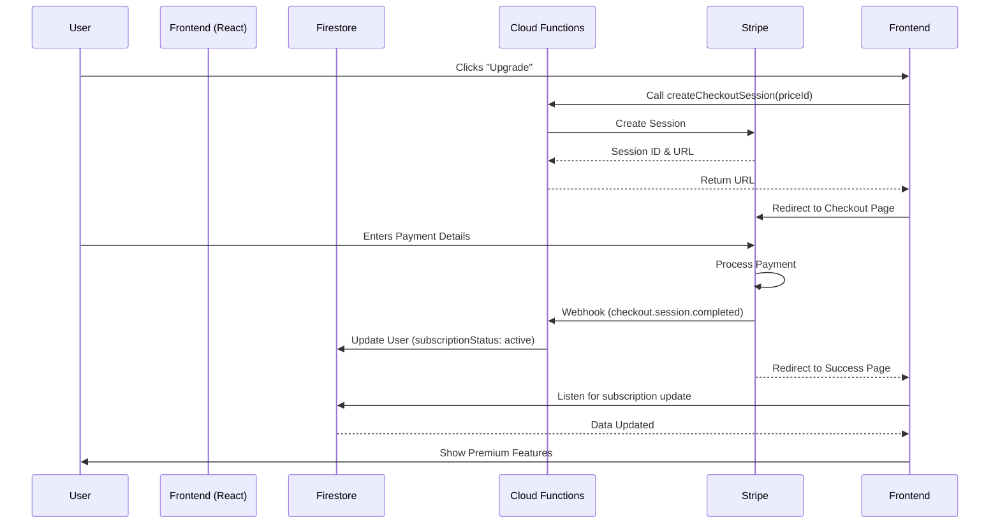

# Payment Gateway Integration Plan

## Executive Summary
This document outlines the architecture and implementation steps for integrating a robust payment system into the **HomeCampus AI** platform.

**Selected Gateway:** **Stripe**
*   **Reasoning:** Industry standard, developer-friendly, excellent documentation, and seamless integration with React and Firebase.
*   **Model:** **Stripe Checkout** (Hosted) for the simplest and most secure compliance (PCI-DSS handled by Stripe), combined with **Stripe Customer Portal** for subscription management.

**Backend Strategy:** **Firebase Cloud Functions**
*   **Reasoning:** The current architecture is serverless. We cannot process payments on the client side securely. Cloud Functions will act as the secure backend to talk to Stripe.

---

## 1. Architecture Overview



---

## 2. Database Schema (Firestore)

We will augment the existing `users` collection and add a `payments` sub-collection.

### `users/{userId}`
| Field | Type | Description |
| :--- | :--- | :--- |
| `stripeCustomerId` | `string` | The ID of the customer in Stripe (e.g., `cus_123...`). |
| `subscriptionStatus` | `string` | `active`, `past_due`, `canceled`, `unpaid`, or `none`. |
| `subscriptionId` | `string` | The ID of the active subscription (e.g., `sub_xyz...`). |
| `priceId` | `string` | The Stripe Price ID the user is subscribed to. |
| `currentPeriodEnd` | `timestamp` | When the current billing cycle ends. |

### `users/{userId}/payments/{paymentId}`
| Field | Type | Description |
| :--- | :--- | :--- |
| `amount` | `number` | Amount paid (in cents). |
| `currency` | `string` | e.g., `sgd`, `usd`. |
| `status` | `string` | `succeeded`, `failed`. |
| `created` | `timestamp` | Payment date. |
| `invoiceUrl` | `string` | Link to the hosted Stripe invoice (PDF). |

---

## 3. Implementation Steps

### Phase 1: Backend Setup (Critical)
**Objective:** Establish a secure environment for payment processing.

1.  **Initialize Cloud Functions**:
    *   Run `firebase init functions` in the project root.
    *   Select **TypeScript** for type safety.
2.  **Install Dependencies**:
    *   `npm install stripe firebase-admin firebase-functions`
3.  **Environment Configuration**:
    *   Set Stripe Secret Keys in Firebase config:
        *   `stripe.secret_key` (Test mode initially, Live mode later)
        *   `stripe.webhook_secret`

### Phase 2: Backend Logic (The "Brain")
**Objective:** Handle payment creation and asynchronous status updates.

1.  **`createCheckoutSession` (Callable Function)**:
    *   **Input**: `priceId` (e.g., Monthly or Yearly plan).
    *   **Logic**:
        *   Check if user already has a `stripeCustomerId`. If not, create one in Stripe and save to Firestore.
        *   Create a Stripe Checkout Session with `mode: 'subscription'`.
        *   Set `success_url` and `cancel_url`.
        *   Attach `metadata` (userId) to track who is paying.
    *   **Output**: `sessionId` and `url`.

2.  **`stripeWebhook` (HTTPS Function)**:
    *   **Input**: HTTP POST request from Stripe.
    *   **Logic**:
        *   **Verify Signature**: Ensure request is genuinely from Stripe using `stripe.webhook_secret`.
        *   **Handle Events**:
            *   `checkout.session.completed`: Grant access. Update `subscriptionStatus` to `active`.
            *   `invoice.payment_succeeded`: Renew access (for recurring payments).
            *   `invoice.payment_failed`: Mark `subscriptionStatus` as `past_due`.
            *   `customer.subscription.deleted`: Revoke access. Mark `subscriptionStatus` as `canceled`.
    *   **Idempotency**: Ensure processing the same event ID twice doesn't corrupt data.

3.  **`createPortalSession` (Callable Function)**:
    *   **Logic**: Create a session for the Stripe Customer Portal so users can self-manage (cancel, upgrade, update card).

### Phase 3: Frontend Integration
**Objective:** Provide a seamless user interface.

1.  **Pricing Page**:
    *   Display plans (Free, Monthly, Yearly).
    *   "Upgrade" button triggers `createCheckoutSession`.
2.  **Checkout Flow**:
    *   Call the backend function.
    *   `window.location.href = url` (Redirect to Stripe).
3.  **Success/Cancel Pages**:
    *   `/payment/success`: "Thanks for subscribing! You are now a Pro member."
    *   `/payment/cancel`: "Payment was cancelled."
4.  **Route Protection**:
    *   Create a `<ProtectedRoute>` wrapper that checks `user.subscriptionStatus` before rendering premium content.

### Phase 4: Security & Testing
1.  **Firestore Rules**:
    ```javascript
    match /users/{userId} {
      allow read: if request.auth.uid == userId;
      // Only allow backend (admin SDK) to write subscription fields
      allow write: if false; 
    }
    ```
2.  **Testing Strategy**:
    *   Use **Stripe Test Cards** (e.g., 4242 4242...) to simulate success, failure, and authentication checks.
    *   Use **Stripe CLI** to trigger local webhooks during development (`stripe listen`).

---

## 4. Technical Considerations & Risks

*   **Webhook Latency**: There can be a slight delay (seconds) between payment and the webhook firing. The "Success" page should handle this gracefully (e.g., "Activating your account...").
*   **Error Handling**: If the webhook fails, Stripe retries for 3 days. We must ensure our code doesn't crash on valid requests.
*   **Currency**: Ensure all prices are consistent (e.g., SGD) across Stripe Dashboard and App.

## 5. Next Steps
1.  **Approve this plan.**
2.  **Set up Stripe Account** (if not already done) and get API keys.
3.  **Begin Phase 1 (Backend Setup).**
